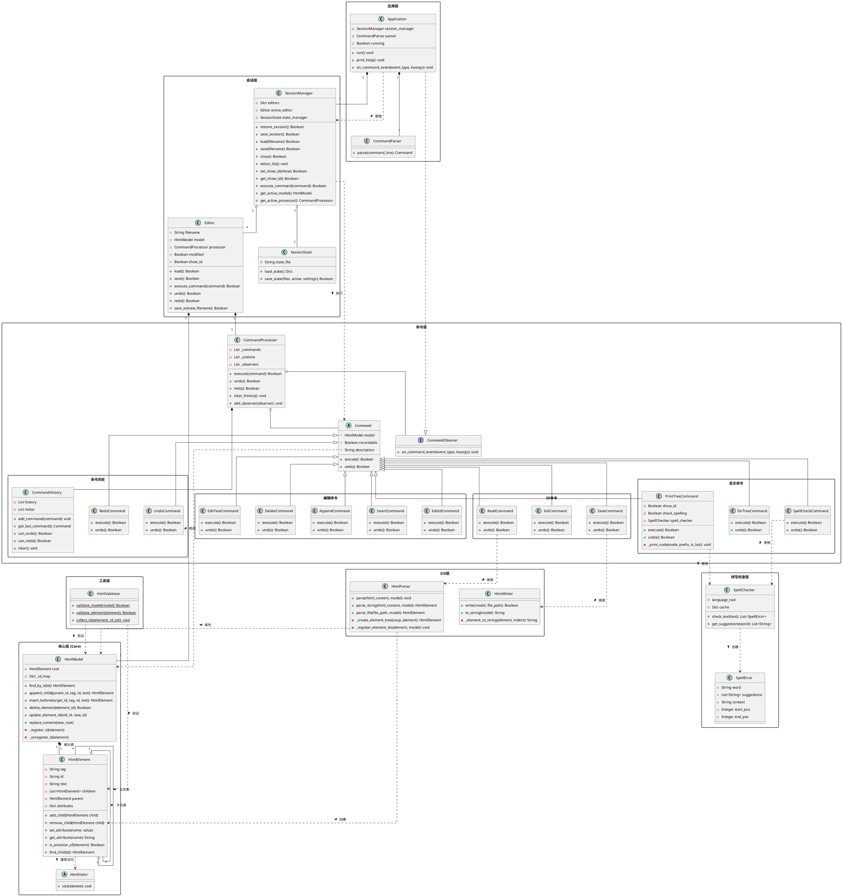

# HTML编辑器项目 - 详细UML类图

本文档提供HTML编辑器项目的详细UML类图和架构概述，帮助开发者理解系统的核心组件和它们之间的关系。

## 完整类图

## 系统架构分层

该HTML编辑器系统采用清晰的分层架构设计:

1. **核心层** - 基础数据结构和模型
2. **I/O层** - 文件读写与解析
3. **工具层** - 辅助功能模块
4. **拼写检查层** - 文本检查服务
5. **命令层** - 命令模式实现
6. **会话层** - 编辑会话管理
7. **应用层** - 程序入口和用户交互

通过这种分层设计和明确的依赖关系管理，系统实现了高内聚低耦合，使各组件能够独立开发、测试和维护。
