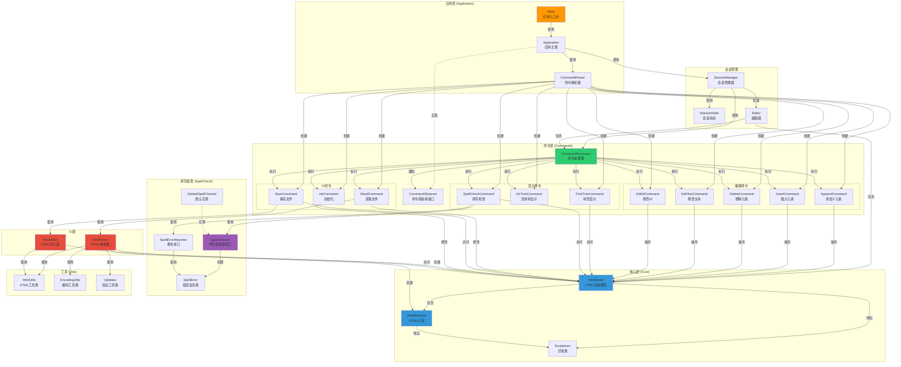
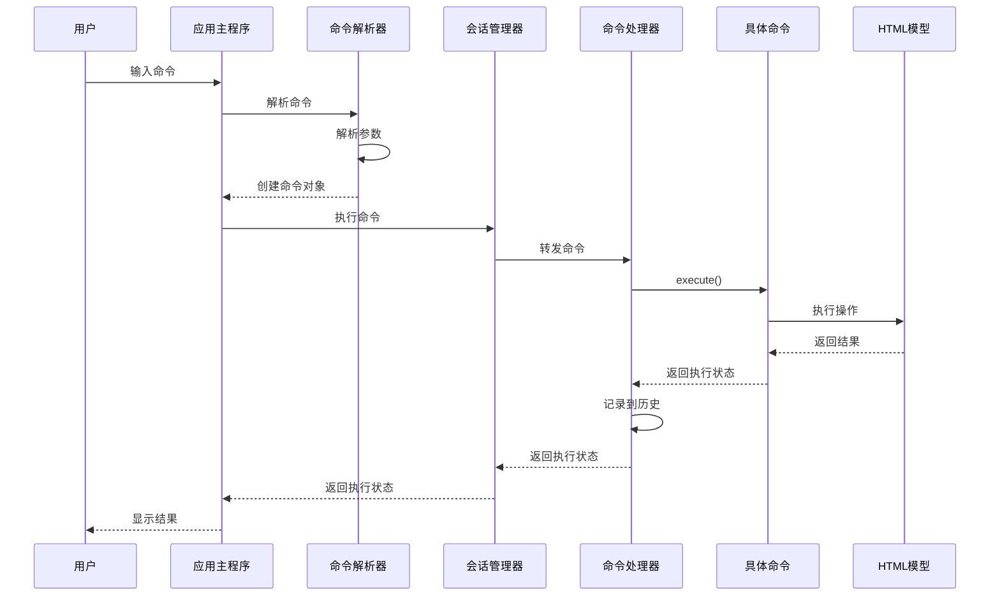
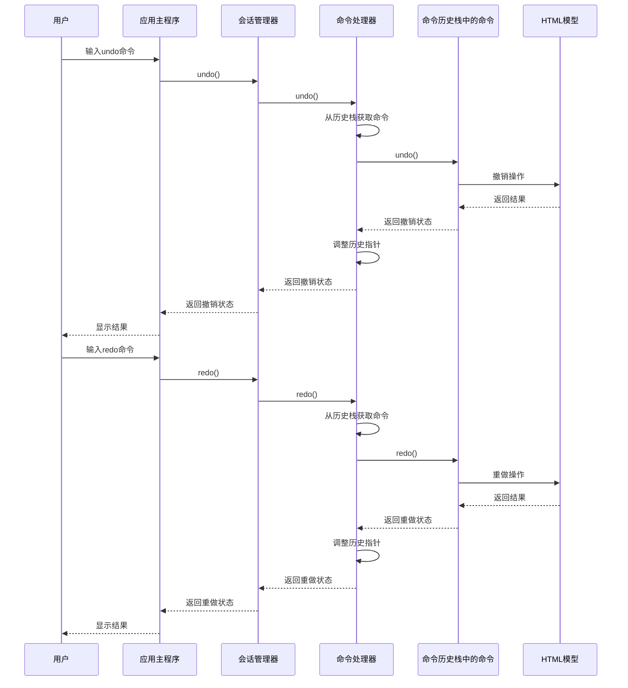
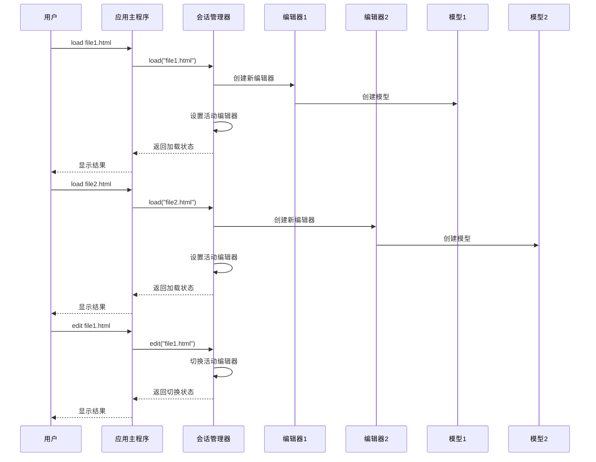
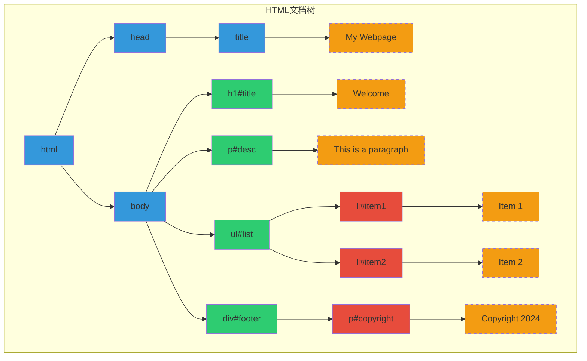
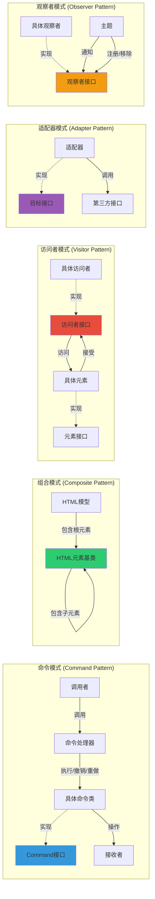
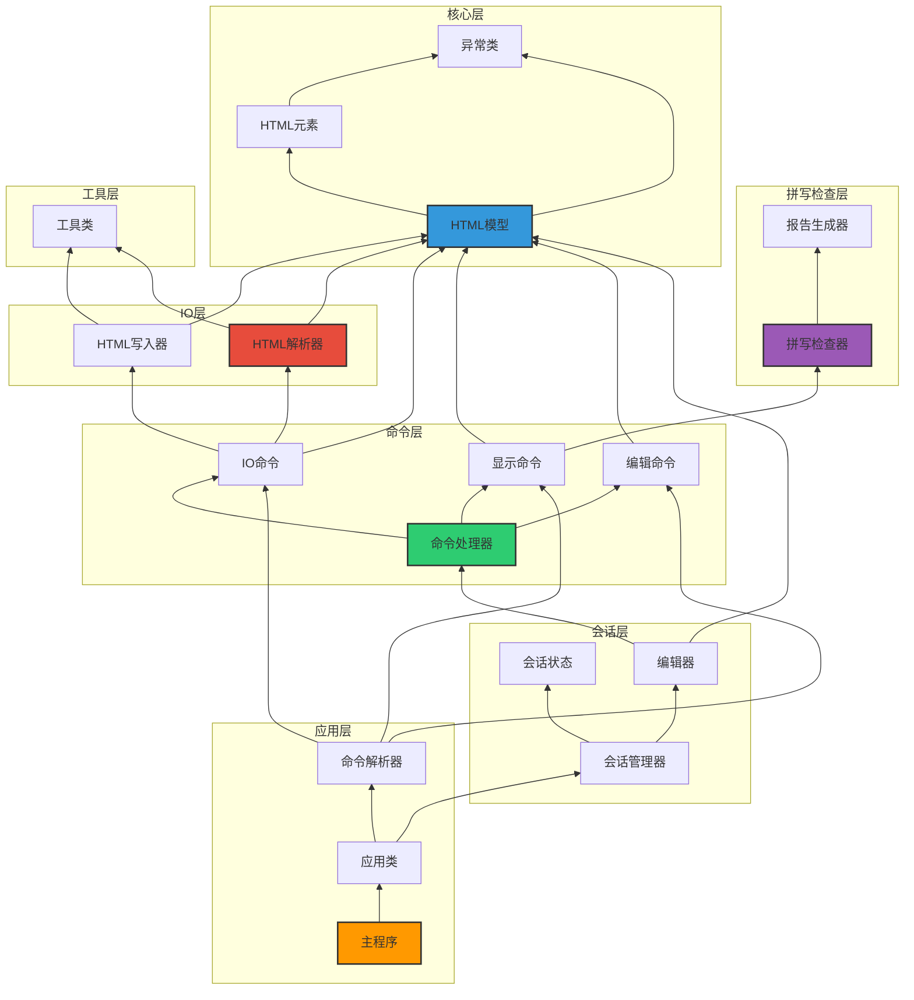
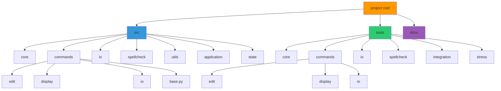

# HTML编辑器完整架构图

## 系统整体架构

```mermaid
graph TB
    subgraph "应用层 (Application)"
        Main["Main\n应用入口点"]
        CommandParser["CommandParser\n命令解析器"]
        Application["Application\n应用主类"]
    end
    
    subgraph "会话管理"
        SessionManager["SessionManager\n会话管理器"]
        SessionState["SessionState\n会话状态"]
        Editor["Editor\n编辑器"]
    end
    
    subgraph "命令层 (Commands)"
        CommandProcessor["CommandProcessor\n命令处理器"]
        CommandObserver["CommandObserver\n命令观察者接口"]
        
        subgraph "编辑命令"
            AppendCommand["AppendCommand\n添加子元素"]
            InsertCommand["InsertCommand\n插入元素"]
            DeleteCommand["DeleteCommand\n删除元素"]
            EditTextCommand["EditTextCommand\n修改文本"]
            EditIdCommand["EditIdCommand\n修改ID"]
        end
        
        subgraph "显示命令"
            PrintTreeCommand["PrintTreeCommand\n树形显示"]
            DirTreeCommand["DirTreeCommand\n目录树显示"]
            SpellCheckCommand["SpellCheckCommand\n拼写检查"]
        end
        
        subgraph "IO命令"
            ReadCommand["ReadCommand\n读取文件"]
            SaveCommand["SaveCommand\n保存文件"]
            InitCommand["InitCommand\n初始化"]
        end
    end
    
    subgraph "核心层 (Core)"
        HtmlModel["HtmlModel\nHTML文档模型"]
        HtmlElement["HtmlElement\nHTML元素"]
        Exceptions["Exceptions\n异常类"]
    end
    
    subgraph "拼写检查 (SpellCheck)"
        SpellChecker["SpellChecker\n拼写检查器接口"]
        DefaultChecker["DefaultSpellChecker\n默认实现"]
        SpellError["SpellError\n错误信息类"]
        SpellReporter["SpellErrorReporter\n报告接口"]
    end
    
    subgraph "IO层"
        HtmlParser["HtmlParser\nHTML解析器"]
        HtmlWriter["HtmlWriter\nHTML写入器"]
    end
    
    subgraph "工具 (Utils)"
        HtmlUtils["HtmlUtils\nHTML工具类"]
        EncodingUtils["EncodingUtils\n编码工具类"]
        Validator["Validator\n验证工具类"]
    end
    
    %% 应用层依赖
    Main -->|使用| Application
    Application -->|使用| CommandParser
    Application -->|使用| SessionManager
    Application -.->|实现| CommandObserver
    
    %% 会话管理依赖
    SessionManager -->|管理| Editor
    SessionManager -->|使用| SessionState
    SessionManager -->|使用| CommandProcessor
    Editor -->|包含| HtmlModel
    Editor -->|包含| CommandProcessor
    
    %% 命令层依赖
    CommandParser -->|创建| AppendCommand & InsertCommand & DeleteCommand & EditTextCommand & EditIdCommand & PrintTreeCommand & DirTreeCommand & SpellCheckCommand & ReadCommand & SaveCommand & InitCommand
    CommandProcessor -->|执行| AppendCommand & InsertCommand & DeleteCommand & EditTextCommand & EditIdCommand & PrintTreeCommand & DirTreeCommand & SpellCheckCommand & ReadCommand & SaveCommand & InitCommand
    CommandProcessor -->|通知| CommandObserver
    
    %% 编辑命令依赖
    AppendCommand & InsertCommand & DeleteCommand & EditTextCommand & EditIdCommand -->|操作| HtmlModel
    
    %% 显示命令依赖
    PrintTreeCommand -->|访问| HtmlModel
    SpellCheckCommand -->|访问| HtmlModel
    SpellCheckCommand -->|使用| SpellChecker
    SpellCheckCommand -->|使用| SpellReporter
    
    %% IO命令依赖
    ReadCommand -->|使用| HtmlParser
    ReadCommand -->|修改| HtmlModel
    SaveCommand -->|使用| HtmlWriter
    SaveCommand -->|访问| HtmlModel
    InitCommand -->|修改| HtmlModel
    
    %% 核心层依赖
    HtmlModel -->|包含| HtmlElement
    HtmlModel -->|抛出| Exceptions
    HtmlElement -->|抛出| Exceptions
    
    %% 拼写检查依赖
    DefaultChecker -.->|实现| SpellChecker
    SpellChecker -->|创建| SpellError
    SpellReporter -->|使用| SpellError
    
    %% IO层依赖
    HtmlParser -->|创建| HtmlModel
    HtmlParser -->|创建| HtmlElement
    HtmlWriter -->|访问| HtmlModel
    HtmlParser -->|使用| HtmlUtils
    HtmlWriter -->|使用| HtmlUtils
    HtmlParser -->|使用| EncodingUtils
    
    %% 工具依赖
    HtmlParser -->|使用| Validator
    
    style Main fill:#ff9900
    style HtmlModel fill:#3498db
    style HtmlElement fill:#3498db
    style CommandProcessor fill:#2ecc71
    style SpellChecker fill:#9b59b6
    style HtmlParser fill:#e74c3c
    style HtmlWriter fill:#e74c3c
```

## 命令执行流程

```mermaid
sequenceDiagram
    participant User as 用户
    participant Main as 应用主程序
    participant Parser as 命令解析器
    participant Session as 会话管理器
    participant Processor as 命令处理器
    participant Command as 具体命令
    participant Model as HTML模型
    
    User->>Main: 输入命令
    Main->>Parser: 解析命令
    Parser->>Parser: 解析参数
    Parser-->>Main: 创建命令对象
    Main->>Session: 执行命令
    Session->>Processor: 转发命令
    Processor->>Command: execute()
    Command->>Model: 执行操作
    Model-->>Command: 返回结果
    Command-->>Processor: 返回执行状态
    Processor->>Processor: 记录到历史
    Processor-->>Session: 返回执行状态
    Session-->>Main: 返回执行状态
    Main-->>User: 显示结果
```

## 撤销/重做机制

```mermaid
sequenceDiagram
    participant User as 用户
    participant Main as 应用主程序
    participant Session as 会话管理器
    participant Processor as 命令处理器
    participant Command as 命令历史栈中的命令
    participant Model as HTML模型
    
    User->>Main: 输入undo命令
    Main->>Session: undo()
    Session->>Processor: undo()
    Processor->>Processor: 从历史栈获取命令
    Processor->>Command: undo()
    Command->>Model: 撤销操作
    Model-->>Command: 返回结果
    Command-->>Processor: 返回撤销状态
    Processor->>Processor: 调整历史指针
    Processor-->>Session: 返回撤销状态
    Session-->>Main: 返回撤销状态
    Main-->>User: 显示结果
    
    User->>Main: 输入redo命令
    Main->>Session: redo()
    Session->>Processor: redo()
    Processor->>Processor: 从历史栈获取命令
    Processor->>Command: redo()
    Command->>Model: 重做操作
    Model-->>Command: 返回结果
    Command-->>Processor: 返回重做状态
    Processor->>Processor: 调整历史指针
    Processor-->>Session: 返回重做状态
    Session-->>Main: 返回重做状态
    Main-->>User: 显示结果
```

## 多文件编辑切换

```mermaid
sequenceDiagram
    participant User as 用户
    participant Main as 应用主程序
    participant Session as 会话管理器
    participant Editor1 as 编辑器1
    participant Editor2 as 编辑器2
    participant Model1 as 模型1
    participant Model2 as 模型2
    
    User->>Main: load file1.html
    Main->>Session: load("file1.html")
    Session->>Editor1: 创建新编辑器
    Editor1->>Model1: 创建模型
    Session->>Session: 设置活动编辑器
    Session-->>Main: 返回加载状态
    Main-->>User: 显示结果
    
    User->>Main: load file2.html
    Main->>Session: load("file2.html")
    Session->>Editor2: 创建新编辑器
    Editor2->>Model2: 创建模型
    Session->>Session: 设置活动编辑器
    Session-->>Main: 返回加载状态
    Main-->>User: 显示结果
    
    User->>Main: edit file1.html
    Main->>Session: edit("file1.html")
    Session->>Session: 切换活动编辑器
    Session-->>Main: 返回切换状态
    Main-->>User: 显示结果
```

## 数据结构 - HTML元素树

```mermaid
graph TD
    subgraph "HTML文档树"
        html[html]
        head[head]
        body[body]
        title[title]
        h1[h1#title]
        p1[p#desc]
        ul[ul#list]
        div[div#footer]
        li1[li#item1]
        li2[li#item2]
        p2[p#copyright]
        
        html --> head
        html --> body
        head --> title
        body --> h1
        body --> p1
        body --> ul
        body --> div
        ul --> li1
        ul --> li2
        div --> p2
        
        title --> title_text[My Webpage]
        h1 --> h1_text[Welcome]
        p1 --> p1_text[This is a paragraph]
        li1 --> li1_text[Item 1]
        li2 --> li2_text[Item 2]
        p2 --> p2_text[Copyright 2024]
    end
    
    style html fill:#3498db
    style head fill:#3498db
    style body fill:#3498db
    style title fill:#3498db
    style h1 fill:#2ecc71
    style p1 fill:#2ecc71
    style ul fill:#2ecc71
    style div fill:#2ecc71
    style li1 fill:#e74c3c
    style li2 fill:#e74c3c
    style p2 fill:#e74c3c
    
    style title_text fill:#f39c12,stroke-dasharray: 5 5
    style h1_text fill:#f39c12,stroke-dasharray: 5 5
    style p1_text fill:#f39c12,stroke-dasharray: 5 5
    style li1_text fill:#f39c12,stroke-dasharray: 5 5
    style li2_text fill:#f39c12,stroke-dasharray: 5 5
    style p2_text fill:#f39c12,stroke-dasharray: 5 5
```

## 设计模式应用

```mermaid
graph LR
    subgraph "命令模式 (Command Pattern)"
        Command[Command接口]
        ConcreteCommands[具体命令类]
        CommandProcessor[命令处理器]
        Invoker[调用者]
        Receiver[接收者]
        
        Invoker -->|调用| CommandProcessor
        CommandProcessor -->|执行/撤销/重做| ConcreteCommands
        ConcreteCommands -.->|实现| Command
        ConcreteCommands -->|操作| Receiver
    end
    
    subgraph "组合模式 (Composite Pattern)"
        HtmlElement[HTML元素基类]
        HtmlModel[HTML模型]
        
        HtmlModel -->|包含根元素| HtmlElement
        HtmlElement -->|包含子元素| HtmlElement
    end
    
    subgraph "访问者模式 (Visitor Pattern)"
        Visitor[访问者接口]
        ConcreteVisitor[具体访问者]
        Element[元素接口]
        ConcreteElement[具体元素]
        
        ConcreteVisitor -.->|实现| Visitor
        ConcreteElement -.->|实现| Element
        ConcreteElement -->|接受| Visitor
        Visitor -->|访问| ConcreteElement
    end
    
    subgraph "适配器模式 (Adapter Pattern)"
        Target[目标接口]
        Adapter[适配器]
        Adaptee[第三方接口]
        
        Adapter -.->|实现| Target
        Adapter -->|调用| Adaptee
    end
    
    subgraph "观察者模式 (Observer Pattern)"
        Observer[观察者接口]
        ConcreteObserver[具体观察者]
        Subject[主题]
        
        ConcreteObserver -.->|实现| Observer
        Subject -->|通知| Observer
        Subject -->|注册/移除| Observer
    end
    
    style Command fill:#3498db
    style HtmlElement fill:#2ecc71
    style Visitor fill:#e74c3c
    style Target fill:#9b59b6
    style Observer fill:#f39c12
```

## 模块分层和依赖关系

```mermaid
graph BT
    subgraph "应用层"
        Main["主程序"]
        Application["应用类"]
        CommandParser["命令解析器"]
    end
    
    subgraph "会话层"
        SessionManager["会话管理器"]
        SessionState["会话状态"]
        Editor["编辑器"]
    end
    
    subgraph "命令层"
        CommandProcessor["命令处理器"]
        EditCommands["编辑命令"]
        DisplayCommands["显示命令"]
        IOCommands["IO命令"]
    end
    
    subgraph "拼写检查层"
        SpellChecker["拼写检查器"]
        Reporters["报告生成器"]
    end
    
    subgraph "核心层"
        HtmlModel["HTML模型"]
        HtmlElement["HTML元素"]
        Exceptions["异常类"]
    end
    
    subgraph "IO层"
        Parser["HTML解析器"]
        Writer["HTML写入器"]
    end
    
    subgraph "工具层"
        Utils["工具类"]
    end
    
    Main --> Application
    Application --> SessionManager
    Application --> CommandParser
    
    SessionManager --> Editor
    SessionManager --> SessionState
    Editor --> CommandProcessor
    Editor --> HtmlModel
    
    CommandParser --> EditCommands & DisplayCommands & IOCommands
    CommandProcessor --> EditCommands & DisplayCommands & IOCommands
    
    EditCommands --> HtmlModel
    DisplayCommands --> HtmlModel
    DisplayCommands --> SpellChecker
    IOCommands --> HtmlModel
    IOCommands --> Parser
    IOCommands --> Writer
    
    SpellChecker --> Reporters
    
    HtmlModel --> HtmlElement
    HtmlModel --> Exceptions
    HtmlElement --> Exceptions
    
    Parser --> HtmlModel
    Writer --> HtmlModel
    Parser --> Utils
    Writer --> Utils
    
    style Main fill:#ff9900,stroke:#333,stroke-width:2px
    style HtmlModel fill:#3498db,stroke:#333,stroke-width:2px
    style CommandProcessor fill:#2ecc71,stroke:#333,stroke-width:2px
    style SpellChecker fill:#9b59b6,stroke:#333,stroke-width:2px
    style Parser fill:#e74c3c,stroke:#333,stroke-width:2px
```

## 文件结构

```mermaid
graph TB
    Root["project root"]
    
    Src["src"]
    Core["core"]
    Commands["commands"]
    IO["io"]
    SpellCheck["spellcheck"]
    Utils["utils"]
    App["application"]
    State["state"]
    
    Tests["tests"]
    CoreTests["core"]
    CommandTests["commands"]
    IOTests["io"]
    SpellcheckTests["spellcheck"]
    IntegrationTests["integration"]
    StressTests["stress"]
    
    Docs["docs"]
    
    Root --> Src
    Root --> Tests
    Root --> Docs
    
    Src --> Core
    Src --> Commands
    Src --> IO
    Src --> SpellCheck
    Src --> Utils
    Src --> App
    Src --> State
    
    Commands --> EditCommands["edit"]
    Commands --> DisplayCommands["display"]
    Commands --> IOCommands["io"]
    Commands --> CommandBase["base.py"]
    
    Tests --> CoreTests
    Tests --> CommandTests
    Tests --> IOTests
    Tests --> SpellcheckTests
    Tests --> IntegrationTests
    Tests --> StressTests
    
    CommandTests --> EditTests["edit"]
    CommandTests --> DisplayTests["display"]
    CommandTests --> IOCmdTests["io"]
    
    style Root fill:#ff9900
    style Src fill:#3498db
    style Tests fill:#2ecc71
    style Docs fill:#9b59b6
```
