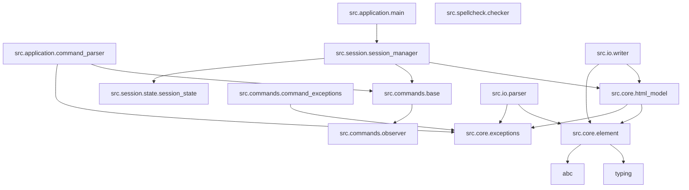

# 详细依赖关系

## 概述

本文档根据导入语句概述了项目中不同模块之间的依赖关系。

## 依赖关系图

### 核心组件

- `src.core.element`: 依赖于 `typing`, `abc`
- `src.core.html_model`: 依赖于 `typing`, `src.core.element`, `src.core.exceptions`
- `src.core.exceptions`: 整个项目中使用的基础异常类

### 模块依赖关系

- `src.application.command_parser` → `src.commands.base`, `src.commands.io`, `src.commands.edit.*`, `src.commands.display`, `src.core.exceptions`
- `src.application.main` → `src.session.session_manager`, `src.commands.edit.*`, `src.commands.display`, `src.session.state.session_state`
- `src.commands.base` → `typing`, `abc`, `src.commands.observer`
- `src.commands.observer` → `abc`
- `src.commands.command_exceptions` → `src.core.exceptions`
- `src.commands.display.base` → `src.commands.base`
- `src.commands.display.print_tree` → `src.core.html_model`, `src.core.element`, `src.spellcheck.checker`, `src.commands.base`
- `src.commands.display.spell_check` → `src.core.html_model`, `src.core.element`, `src.spellcheck.checker`, `src.commands.base`
- `src.commands.display.dir_tree` → `os`, `src.commands.base`
- `src.commands.edit.append_command` → `src.commands.base`, `src.core.html_model`, `src.core.element`, `src.core.exceptions`, `src.commands.command_exceptions`
- `src.commands.edit.delete_command` → `src.commands.base`, `src.core.html_model`, `src.core.element`, `src.core.exceptions`, `src.commands.command_exceptions`
- `src.commands.edit.edit_id_command` → `src.commands.base`, `src.core.exceptions`, `src.commands.command_exceptions`
- `src.commands.edit.edit_text_command` → `src.commands.base`, `src.core.html_model`, `src.core.exceptions`, `src.commands.command_exceptions`
- `src.commands.edit.insert_command` → `src.commands.base`, `src.core.html_model`, `src.core.element`, `src.core.exceptions`, `src.commands.command_exceptions`
- `src.commands.io.init` → `os`, `src.commands.base`, `src.core.html_model`, `src.io.parser`, `src.core.exceptions`, `src.commands.command_exceptions`, `src.utils.html_utils`
- `src.commands.io.read` → `os`, `src.commands.base`, `src.core.html_model`, `src.io.parser`, `src.core.exceptions`, `src.commands.command_exceptions`, `src.utils.html_utils`
- `src.commands.io.save` → `os`, `src.commands.base`, `src.core.html_model`, `src.io.parser`, `src.core.exceptions`, `src.commands.command_exceptions`, `src.utils.html_utils`
- `src.io.parser` → `os`, `bs4`, `typing`, `chardet`, `src.core.exceptions`, `src.core.element`
- `src.io.writer` → `src.core.html_model`, `src.core.element`, `html`
- `src.session.session_manager` → `src.core.html_model`, `src.commands.base`, `src.commands.io`, `src.commands.command_exceptions`, `src.commands.display`, `src.session.state.session_state`, `os`
- `src.session.state.session_state` → `os`, `json`, `typing`
- `src.spellcheck.checker` → `abc`, `typing`, `dataclasses`, `re`, `os`, `json`, `spellchecker`
- `src.spellcheck.adapters.language_tool` → `typing`, `spellchecker`, `src.spellcheck.checker`
- `src.utils.html_utils` → `html`
- `src.utils.validator` → `typing`, `src.core.html_model`, `src.core.element`, `src.core.exceptions`

### 循环依赖

- `src.commands` 模块在 base, display, edit 和 io 包之间有内部链接依赖，但架构避免了有问题的循环导入
- `run.py` 导入了大多数模块，作为应用程序入口点

## 依赖树

- src
  - application
    - command_parser (依赖于 commands, core)
    - main (依赖于 session, commands)
  - commands
    - base (依赖于 observer)
    - observer (依赖于 abc)
    - command_exceptions (依赖于 core.exceptions)
    - display (依赖于 core, spellcheck, commands.base)
    - edit (依赖于 core, commands.base, command_exceptions)
    - io (依赖于 core, io.parser, commands.base, utils)
  - core
    - element (基础组件)
    - exceptions (基础组件)
    - html_model (依赖于 element, exceptions)
  - io
    - parser (依赖于 bs4, core)
    - writer (依赖于 core)
  - session
    - session_manager (依赖于 core, commands, session.state)
    - state
      - session_state (依赖于 os, json)
  - spellcheck
    - checker (依赖于 abc, spellchecker)
    - adapters
      - language_tool (依赖于 spellcheck.checker)
  - utils
    - html_utils (依赖于 html)
    - validator (依赖于 core)

## 可视化依赖图

可以使用以下工具绘制依赖关系图：

### Mermaid 图表示例

